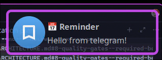

# poshanka

Wayland popup subscriber

## Requirements

- A Wayland compositor with `wlr-layer-shell-unstable-v1`
- [notred](https://github.com/Gigas002/notred) or similar FDN daemon poshanka subscribes to, with its `notredctl` connector CLI on `$PATH`
- `libcairo2` / `libpango-1.0`

## Configuration

poshanka reads config from `$XDG_CONFIG_HOME/poshanka/` (falls back to `~/.config/poshanka/` if `$XDG_CONFIG_HOME` is unset), or from `--config <path>`:

| File               | Role                                                                          |
| ------------------ | ----------------------------------------------------------------------------- |
| `config.toml`      | Placement, stack gap, layer-shell anchor/layer, `[provider]` wiring           |
| `theme.toml`       | Card look — font, colors, layout, Pango templates (path from `[paths].theme`) |
| override fragments | Per-app / per-urgency theme patches (paths from `[paths].overrides`)          |

Start from the reference files under `examples/`: copy `examples/config.toml`, `examples/theme.toml`, and (optionally) `examples/apps/`, `examples/urgency/`, and `examples/scripts/notred-subscribe.sh` into `$XDG_CONFIG_HOME/poshanka/`, adjusting `[provider].exec` if you relocate the subscribe script.
